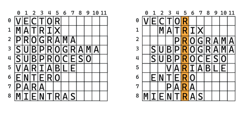

# Desafío integrador Grupal

> 🚀 RECUERDEN: Antes de comenzar, asegúrense de leer todo el enunciado para comprender el alcance completo de la actividad.
---
> 💡 Para empezar, les recomendamos ordenar el diagrama de flujo de las acciones necesarias que deben cubrir. Pueden utilizar herramientas como compartir pantalla o pizarras compartidas, como Jamboard o Excalidraw, para facilitar esta tarea.
---
> 🔍 Es importante reconocer qué variables serán necesarias y de qué tipo deben ser definidas para llevar a cabo la actividad de manera eficiente.

## Palabras Cruzadas

Se requiere crear una matriz con palabras específicas y luego ajustarlas de manera que la primera letra 'R' de cada palabra quede en la posición 5, alineándose correctamente. Para abordar este problema de manera eficiente y organizada, se propone dividir el trabajo en subprogramas o funciones.

Deberán al menos contemplar los siguientes subprogramas:

subprograma inicializarMatriz: Esta función inicializará la matriz con un asterisco en cada celda para evitar problemas y garantizar que no esté vacía. Deberá recibir como parámetros la matriz a inicializar, la cantidad de filas y la cantidad de columnas.

1. **subprograma inicializarMatriz**: Esta función inicializará la matriz con un asterisco en cada celda para evitar problemas y garantizar que no esté vacía. Deberá recibir como parámetros la matriz a inicializar, la cantidad de filas y la cantidad de columnas.

2. **subprograma imprimirMatriz**: Esta función imprimirá la matriz en la consola. Para evitar que las letras queden pegadas, entre cada letra se imprimirá un espacio. Recibirá como parámetros la matriz a imprimir, la cantidad de filas y la cantidad de columnas.

3. **subprograma agregarPalabra**: Esta función agregará una palabra en una fila específica de la matriz. Recibirá como parámetros la matriz donde se agregará la palabra, la fila en la que se agregará y la propia palabra.

4. **subprograma buscarR**: Esta función buscará la primera letra 'R' en una fila determinada de la matriz y devolverá su posición. Recibirá como parámetros la matriz donde se buscará la letra 'R' y el número de fila en el que se buscará.

5. **subprograma acomodarPalabra**: Esta función acomodará las palabras en la matriz según la posición de la primera letra 'R'. Para ello, moverá las palabras hacia la izquierda o hacia la derecha según sea necesario, rellenando los espacios vacíos con asteriscos nuevamente.

> 🤝Aunque no hayan logrado completar todos los puntos de las actividades en equipo, cada integrante puede luego terminarlas de manera individual. Esta experiencia colaborativa les permitirá afianzar los conocimientos adquiridos, desarrollar habilidades de pensamiento lógico y creativo, así como también fomentar la cooperación entre los miembros del equipo. Además, al trabajar juntos, tendrán la oportunidad de enriquecerse académicamente al compartir y discutir diversas opiniones y perspectivas. Si bien el resultado final es importante, el proceso de trabajo en equipo es igualmente valioso para el aprendizaje y el crecimiento personal.
